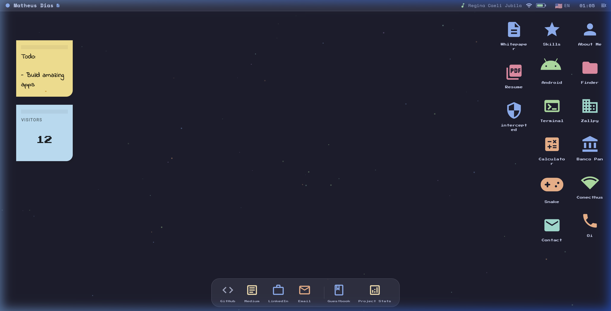
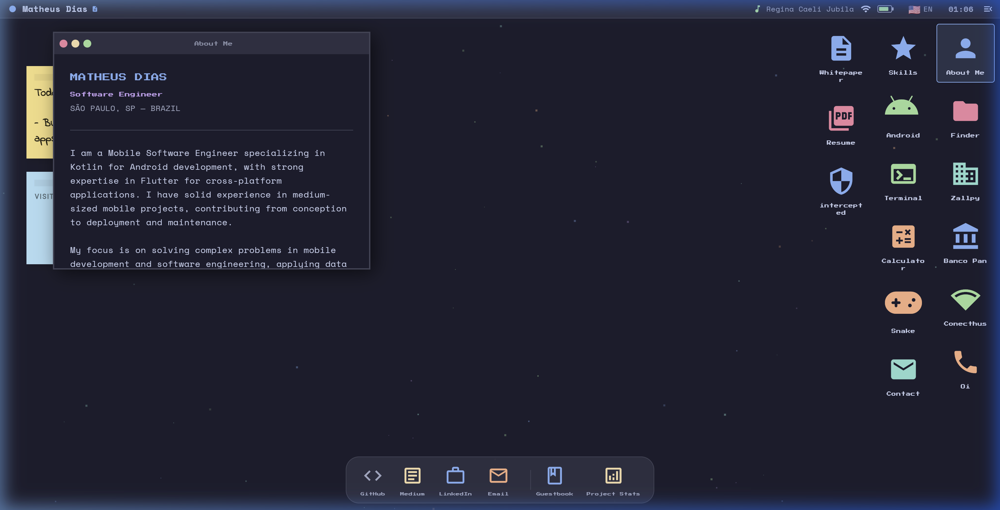

# 🖥️ MathOS — Interactive Desktop Portfolio

[](https://github.com/Mathvdias/portifolio/actions/workflows/main.yml)
[](https://flutter.dev)
[](https://firebase.google.com)
[](https://opensource.org/licenses/MIT)

**MathOS** is a pixel-art, macOS-inspired interactive portfolio built with Flutter. It features a custom window management system, real-time stats, and a retro boot experience, all delivered as a high-performance web application.



---

## 🚀 Key Features

- **Interactive Desktop**: A custom-built windowing system (`packages/app_window`) that allows dragging, focusing, and managing multiple tools simultaneously.
- **Pixel-Art Engine**: Custom pixel-art icons and UI elements drawn using the Flutter Canvas API (`packages/pixel_art`).
- **Real-time Guestbook**: Full Firestore integration for leaving messages and feedback.
- **Retro Boot Sequence**: A simulated BIOS and kernel boot sequence for that classic 90s feel.
- **Dynamic Project Stats**: CI/CD automated updates for code coverage and project metrics.
- **Multilingual**: Support for English and Portuguese (expandable to more).

## 🏗️ Architecture & Patterns

The project is built with a focus on **Clean Architecture** principles and **Clean Code** patterns, ensuring a scalable and maintainable codebase.

### Folder Structure (Feature-First)
- `lib/features/`: Divided by functional modules (Guestbook, Desktop, Game, etc.).
- `lib/shared/`: Reusable widgets, models, and services.
- `lib/core/`: Constants, theme definitions, and utilities.
- `packages/`: Internal standalone packages for modularity.

### State Management & Design Patterns
- **MVVM (Model-View-ViewModel)**: Separation of concerns between UI and business logic using `ChangeNotifier`.
- **InheritedWidget**: Used as a high-performance, native Dependency Injection (DI) container and for global state management (Window stack, Locale).
- **Service & Repository Pattern**: Abstraction layers for data fetching (Firebase) and business logic.
- **Result Type**: Functional error handling using a sealed `Result` class.

## 🛠️ Tech Stack

- **Framework**: [Flutter](https://flutter.dev) (Web Release)
- **Backend**: [Firebase](https://firebase.google.com) (Firestore, Hosting)
- **CI/CD**: [GitHub Actions](https://github.com/features/actions)
- **Fonts**: Space Mono, Outfit (via Google Fonts)
- **Localization**: `flutter_localizations` (l10n)

## 🦾 Robust CI/CD Pipeline

The project implements a comprehensive CI/CD workflow to ensure code quality and seamless delivery:

1.  **Static Analysis**: Strict linting rules and formatting checks (`dart format`).
2.  **Automated Testing**: Unit and widget tests with coverage metrics.
3.  **Stats Generation**: Custom Dart scripts that update project metadata on every push.
4.  **Optimized Build**: Automated standard release builds for Firebase Hosting.
5.  **Dependabot**: Automatic dependency updates for both Flutter and GitHub Actions.

## 📸 Screenshots

### About Me


---

## 🛠️ Getting Started

### Prerequisites
- Flutter SDK (v3.7.0 or higher)
- Firebase CLI (for deployment)

### Running Locally
```bash
# Clone the repository
git clone https://github.com/Mathvdias/portifolio.git

# Install dependencies
flutter pub get

# Run the app
flutter run -d chrome
```

## 📄 License
This project is licensed under the MIT License - see the [LICENSE](LICENSE) file for details.

---
Created with ❤️ by **Matheus Dias**
